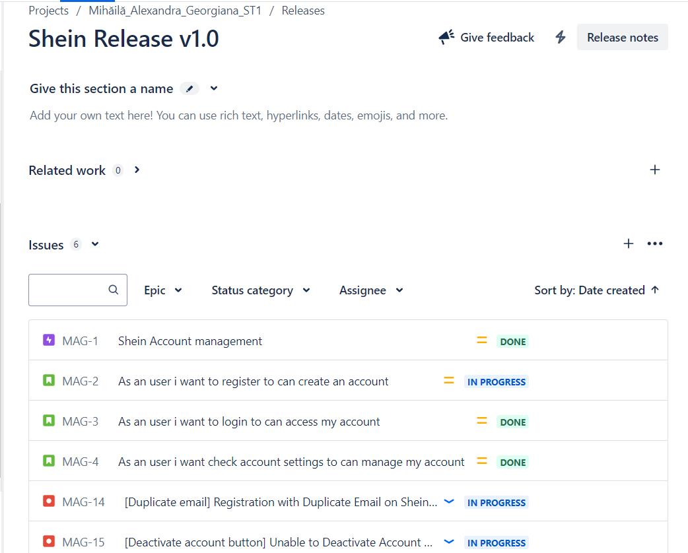
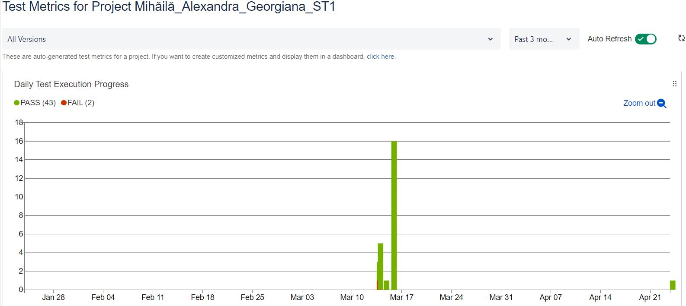

<h1>Testing Project for **Shein**</h1>

The scope of the final project for ITF Manual Testing Course is to use all gained knowledge throught the course and apply them in practice, using a live application.

Application under test:<h3>Shein</h3>

Tools used: Jira, Zephyr Squad.

<h2>Functional specifications:</h2>

The below stories were created in Jira and describe the functional specifications of the "**Account**" module, for which the final project is performed upon.

<h3>[story1.pdf](documente%2Fstory1.pdf)</h3>
<h3>[story2.pdf](documente%2Fstory2.pdf)</h3>
<h3>[story3.pdf](documente%2Fstory3.pdf)</h3>

**Here you can find the release that was created for this project:**

      

 

<h2>Testing process</h2>

The test process was performed based on the standard test process as described below.

<h3>1.1 Test planning</h3>

The Test Plan is designed to describe all details of testing for account module from the Shein application.

The plan identifies the items to be tested, the features to be tested, the types of testing to be performed, the personnel responsible for testing, the resources and schedule required to complete testing,and the risks associated with the plan. The test plan that was created for this project can be found here
<h3>[testplan..pdf](documente%2Ftestplan..pdf)</h3>

<h4>1.1.1. Roles asigned to the project and persons allocated</h4>
<ul>
  <li>Project Manager Dobre Andreea</li>
  <li>Product Owner Cristian Matei</li>
  <li>Software Developer Marius Cristian</li>
  <li>QA Engineer Alexandrescu Matei </li>
  <li>QA Tester Mihaila Alexandra Georgiana</li>
</ul>

<h4> 1.1.2 Entry criteria defined </h4>
<ul>
    <li>Availability of test data including sample user accounts for testing various scenarios.</li>
   <li>Clear understanding of user roles and permissions within the account module. </li>
    <li>Test environment setup and configuration completed, including any necessary test data   preparation or configuration.</li>
    <li>Availability of test resources, including testers, testing tools, and documentation necessary for conducting tests effectively.</li> 
</ul>

<h4> 1.1.3 Exit criteria defined </h4>
<ul>
    <li>All functional requirements outlined in the specification document have been thoroughly tested and validated. </li>
    <li> All critical and high-priority defects identified during testing have been resolved, and their fixes have been verified through retesting.</li>
    <li>The Account Module demonstrates stability and reliability under various load conditions and usage scenarios, with no significant performance degradation or system crashes.</li>
    <li>No high priority or severe bugs are left outstanding.</li>
<li>All high-risk areas have been fully tested,with only minor residual risks left outstanding.</li>
</ul>

<h4> 1.1.4 Test scope</h4>

<h5> Tests in scope: </h5>
<ul>
<li>Account Registration (registration process for new users, functionality of email verification for account activation.)</li>
<li>Login and Authentication (user login functionality with valid and invalid credentials).</li>
 <li>Profile Management ( ability to update and edit user profiles).</li>
<li>Password Management (the process of changing passwords and password recovery functionality).</li>
<li>Address Book Management (the ability to add, edit, and delete shipping addresses in the user's address book).</li>
<li>Error Handling and Validation.</li>
</ul>

<h5>Tests not in scope: </h5>
<ul>
<li>Testing functionalities specific to Shein's mobile applications, including iOS and Android platforms. </li>
<li>Testing functionalities related to backend systems such as databases, APIs. </li>
<li>Performance testing of external services or dependencies used by the Account Module but not directly controlled by Shein. </li>
<li>Testing network infrastructure, including network latency, bandwidth, or routing configurations.</li>
</ul>
<h4>1.1.5 Risks detected</h4>

<h5>Project risks:</h5> 
<ul>
   <li>Data Integrity Issues: Risks related to data integrity, including data corruption or loss, may occur during account management operations such as profile updates or password changes.</li>
   <li>Security Vulnerabilities: There is a risk of security vulnerabilities such as data breaches, or unauthorized access to user information due to inadequate security measures or implementation flaws.</li>
   <li>Third-Party Dependencies: Risks associated with third-party dependencies, such as service outages or changes to APIs, may disrupt functionality or integration with external services used by the Account Module.</li>
  <li>Data Privacy Concerns: Risks associated with data privacy concerns, including unauthorized access to sensitive user information or misuse of personal data, may undermine user trust and loyalty to the platform.</li>
</ul>

<h5> Product risks: </h5>
<ul>
  <li>Security Vulnerabilities : Significant impact on your privacy and security. </li>
  <li>Fraud or phishing: Financial losses or compromising the user's security. </li>
  <li>Failures in the site's security system: Exposure of users' personal data and potential financial or privacy losses. </li>
  <li>Misuse of personal data : Exposure to additional security and privacy risks. </li>

</ul>

<h4>1.1.6 Evaluating entry criteria</h4>

The entry criteria defined in the Test Planning phase have been achieved and the test process can continue.

<h3>1.2 Test Monitoring and Control</h3>

<li>Monitor daily the status of open defects, prioritize them based on severity and impact, and ensure timely resolution by the development team.</li>
<li>Weekly regular status meetings with the testing team to discuss progress, challenges, and any deviations from the test plan.</li>
<li>Daily monitor resource allocation and utilization to ensure that the testing team has the necessary resources, including personnel, tools, and infrastructure, to execute testing effectively. </li>
<li>Daily open communication channels with stakeholders, including project managers, developers, and business analysts, to provide regular updates on testing progress and any significant findings.</li>
<li>Weekly reviews and audits of test artifacts, including test cases, test plans, and test results, to ensure compliance with quality standards and best practices.</li>
</ul>

   

<h3> 1.3 Test Analysis </h3>
The testing process will be executed based on the application requirements. 

The following test conditions were found:  	
<ul>
<li>Verify if user can successfully register with unique email and password.</li>
<li>Verify is system rejects invalid email formats during registration.</li>
<li>Verify if system prevents registration with an email already in use.</li>
<li>Verify if all required fields are filled during registration.</li>
<li>Verify is system enforces password strength requirements (e.g., minimum length, special characters).</li>
<li>Verify if user can deactivate or delete the account.</li>
<li>Verify if user can log in with correct email/username and password.</li>
<li>Verify if system  provides error message after multiple failed attempts.</li>
<li>Verify persistence of login state across sessions when "Remember Me" option is selected.</li>
<li>Verify if  user remains logged in during active session and is logged out after session expiration or manual logout.</li>
<li>Verify if the platform supports social login via Facebook.</li>
<li>Verify if the platform supports social login via Google.</li>
<li>Verify if user can update profile information (nickname )successfully. </li>
<li>Verify if user can add personal address.</li>
<li>Verify if user can add body measurements.</li>
<li>Verify if User can access “ manage my account” section.</li>
<li>Verify if user can change the email from the “Manage my account “ section.</li>
<li>Verify if user can verify  the email from the “Manage my account” section.</li>
<li>Verify if user can add phone number from the “Manage my account”section.</li>
<li>Verify if user can change password from the “Manage my account”section.</li>
<li>Verify if user can download his information from the “Manage my account”section.</li>
<li>Verify if user can use coupons from “my assets” section.</li>
<li>Verify if user can check points from “my assets” section.</li>                                   
<li>Verify if user can use wallet from “my assets” section.</li>
<li>Verify if user can use gift card from “my assets” section.</li>
<li>Verify if user can check all orders from “my orders” field.</li>
<li>Verify if user can check unpaid orders from “my orders”  field.</li>
<li>Verify if user can check processing orders from “my orders”  field.</li>
<li>Verify if user can check shipped orders from “my orders”  field.</li>
<li>Verify if user can check review orders from “my orders”  field.</li>
<li>Verify if user can check returned orders from “my orders”  field.</li>
<li>Verify if user can check wishlist from “my concern” section.</li>
<li>Verify if user can check recently viewed from “my concern” section.</li>
<li>Verify if user can check follow from “my concern” section.</li>
<li>Verify if user can check messages from “customer service” section.</li>
<li>Verify if user can check service records from “customer service” section.</li>
<li>Verify if user can check free trial center from from “other services” section.</li>
<li>Verify if user can check survey center from “other services” section.</li>
<li>Verify if user can check &use share&earn from “other services” section.</li>
<li>Verify if user can check contact preferences from “other services” section.</li>
<li>Verify if user can check  shipping info from “policy” section.</li>
<li>Verify if you can check return policy from “policy” section.</li>
<li>Verify if user can check privacy & cookie policy from “policy” section.</li>
</ul>

<h3>1.4. Test Design</h3>

Functional test cases were created in Zephyr Squad based on the analysis of the specifications. 
The test cases can be accessed here <h3>[teststeps.pdf](documente%2Fteststeps.pdf)</h3>

<h3>1.5 Test Implementation</h3>

The following elements are needed to be ready before the test execution phase begins:

<h4>1.Test environment</h4> Browsers: Google Chrome, Mozilla Firefox, Microsoft Edge, Apple Safari, Internet Explorer (IE) ,Opera, Brave
<h4>2.Testing tools :</h4>  TestRail , Jira,Excel/Google Sheets ,Confluence,Slack/Microsoft Teams, Browser Developer Tools , Proxy Tools

<h4>3.Account Creation:</h4> If you haven't already, create an account on Shein's website or mobile app.
<h4>4.Test Data:</h4> Use test data to fill out your account information. This could include a test email address, password, shipping address, etc. Make sure not to use any personal or sensitive information.
<h4>5.Test Scenarios: </h4>
<ul>
<li>Login Test : Verify that you can successfully log in to your account using the test credentials.</li>
<li>Profile Update Test: Test updating your profile information (e.g., name, email, phone number) and ensure the changes are reflected correctly.</li>
<li>Password Change Test: Change the password for your account and verify that the new password works for logging in.</li>
</ul>

<h3>1.6. Test Execution </h3>

Test cases are executed on the created test Cycle summary: Shein account management functionalities .
Bugs have been created based on the failed tests.

The complete bug reports can be found here:

<h3>[bugreport1.pdf](documente%2Fbugreport1.pdf)</h3>
<h3>[bugreport2.pdf](documente%2Fbugreport2.pdf)</h3>

The following is a summary of the bugs that have been found

<ul>
<h3>
<li>[Duplicate email] Registration with Duplicate Email on Shein Account – Priority Low. Severity Low </li>
<li> [Deactivate account button] Unable to Deactivate Account on Shein – Priority Low. Severity Low </li> </h3>
</ul>

Full regression testing is needed on the impacted areas after the bugs are fixed and retesting will be done for every functionality that was previously failed.

1.7 Test Completion
As the Exit criteria were met and satisfied as mentioned in the appropriate section, this feature is suggested to ‘Go Live’ by the Testing team

<h4>The traceability matrix </h4> was generated and can be found here:
<h3>[matricetrasabilitate.xlsx](documente%2Fmatricetrasabilitate.xlsx)</h3>

**Test execution chart** was generated and can be found below. 
<h3>[Dashboard Shein MAG.pdf](documente%2FDashboard%20Shein%20MAG.pdf)</h3>

The final report shows that a number **2** tests have failed of a total of **44**

A number of **2** total bugs were found, from which the priority is: **0** are high and **2** are low.

**The total number of written vs executed tests: 44 written tests / 42 successfully executed tests
90% of the requirements for the purpose were covered, we do not have high-risk situations.
All the defects found have a low risk and severity, they can be fixed later**
